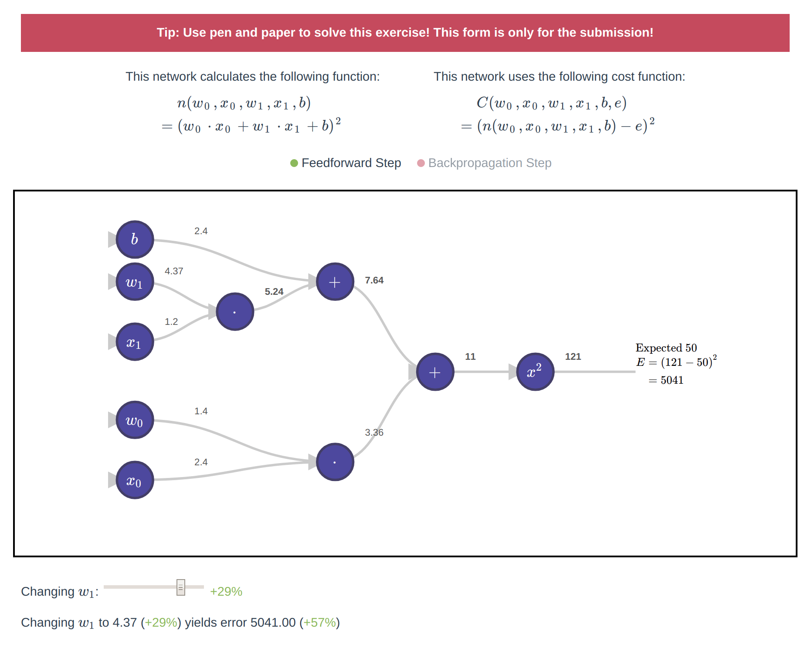

## Vue Backpropagation Exercise

[](https://travis-ci.com/into-ai/vue-backpropagation-exercise)
[](https://www.npmjs.com/package/vue-backpropagation-exercise)
[](https://www.npmjs.com/package/vue-backpropagation-exercise)
[](https://www.npmjs.com/package/vue-backpropagation-exercise)

This vue component packages an interactive web based exercise about visually retracing the backpropagation steps performed when training neural nets. See a [live demo](https://into-ai.github.io/vue-backpropagation-exercise).

```bash
npm install --save vue-backpropagation-exercise
```



#### Configuration

Add the component to your Vue project (this assumes typescript is used):
```javascript
import VueBackpropagationExercise, {
  BackpropGraph
} from "vue-backpropagation-exercise";

@Component({
  components: {
    VueBackpropagationExercise
  }
})
export default class App extends Vue {}
```

Use props to configure the component
```html
<vue-backpropagation-exercise
    :data="netTree"
    :func="netFunc"
    :debug="true"
    :submissionValidator="handleSubmit"
    editable="w_1"
    lang="en"
/>
```

For an example configuration, see `src/App.vue`.

#### Development
- To set up:
    ```
    npm install
    ```

- Compiles and hot-reloads for development:
    ```
    npm run serve
    ```

- Compiles and minifies for production:
    ```
    npm run build
    ```

- Run your unit tests:
    ```
    npm run test:unit
    ```

- Lints and fixes files
    ```
    npm run lint
    ```